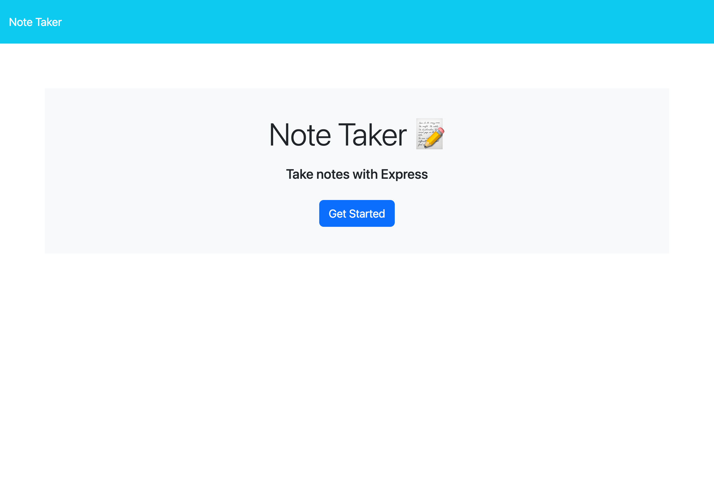
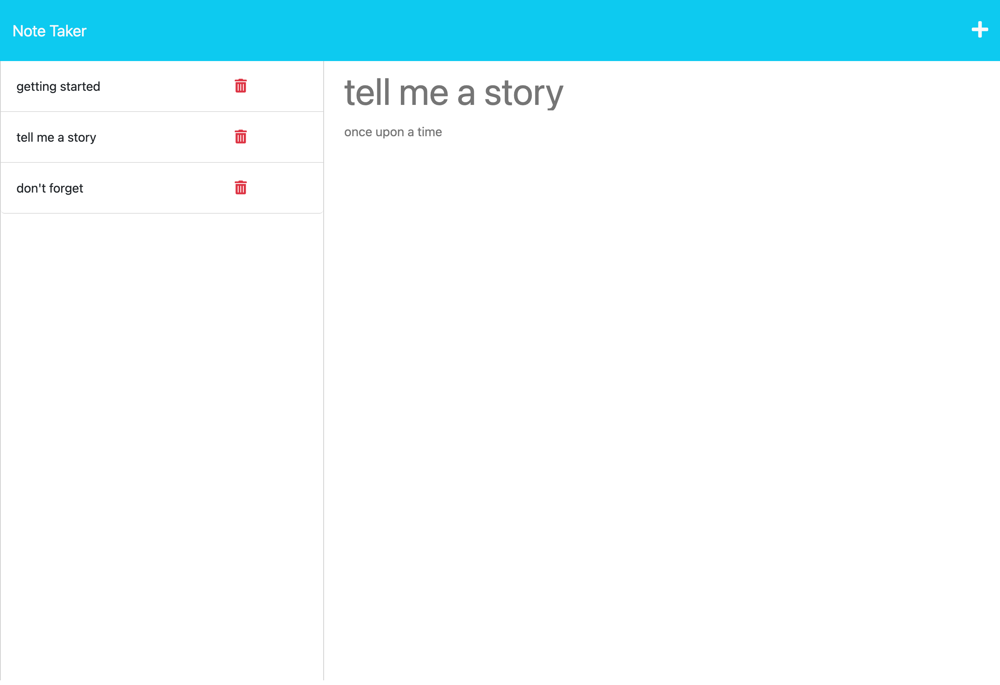

# note-taker

## Description

  With rising expectations to be ever-competitive and always outperform others to get ahead and "make it" in the world, it is becoming increasingly difficult to keep track of all our endeavors. To relieve the pressures of doing, being, providing, and excelling, this note-taking app provides a place to keep track of it all. 
  
  In writing this project, I learned that the basics of building a server that can handle Get and Post requests is the first step to managing data. Additionally, as a bonus, it is possible to Delete notes. There are opportunities to enhance this project with Object Classes as well as building Put request handlers so that users can update their notes in a future version.

## Table of Contents
  - [Installation](#installation)
  - [Usage](#usage)
  - [Credits](#credits)
  - [License](#license)

## Installation
  
N/A. [Deployed site here!](https://cryptic-tundra-56024.herokuapp.com/)

## Usage
  
To open a fresh, new note, start by clicking the Add plus icon in the top right of the screen. Type in the text fields. Save it for later by clicking the Save floppy disc icon. Add as many notes as you would like! To view an older note, search the left-side navigation bar and click on a note's title. No longer need a note? Click the Delete trashcan icon to remove it permanently.

The following image represents the home page:

The following image represents the notes page:

## Contact
  - creator: [miacias](https://github.com/miacias)
  - email: [miaciasullo@gmail.com](mailto:miaciasullo@gmail.com)

## Credits

Documentation referenced:

- Express.js

Tutorials referenced:

- Web Dev Simplified on [YouTube](https://www.youtube.com/watch?v=SccSCuHhOw0) - reinforcing Express.js basics

Tools used:

- [VS Code](https://code.visualstudio.com/)
- Express.js

Tutor(s): 

- [Alexis San Javier](https://github.com/code-guy21) - file structure and file workflow

U. Penn Bootcamp instructor(s): 

- [Dan Gross](https://github.com/DanielWGross)
- [Andrew Hojnowski](https://github.com/aHojo)
- Ross

U. Penn Bootcamp study group:

- [Fredrick Chang](https://github.com/LearnedDr)
- [Stevie O'Connell](https://github.com/OConnell-Coder)

## License
  
MIT

